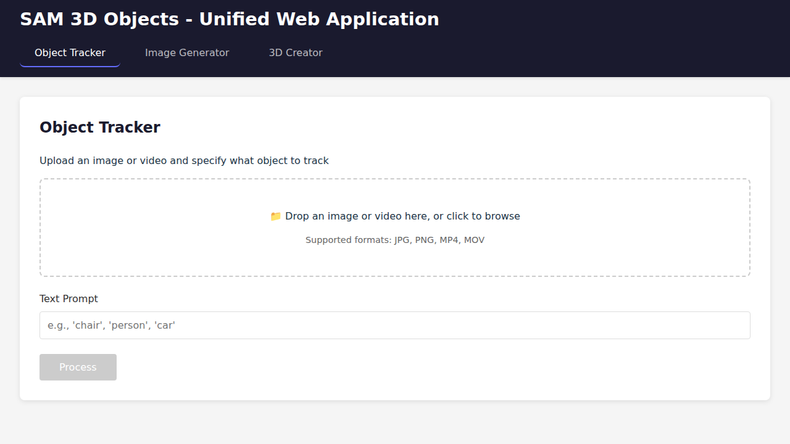
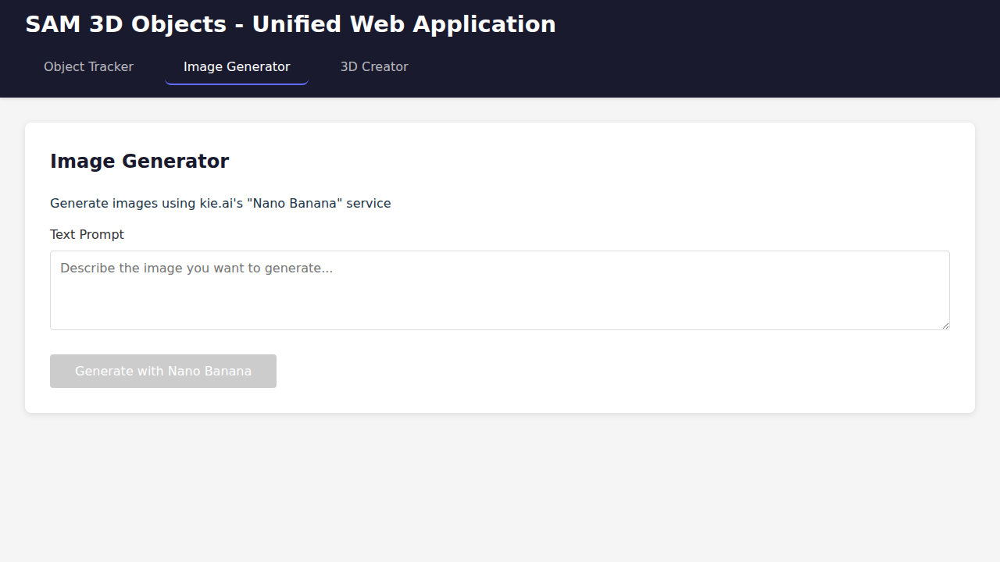
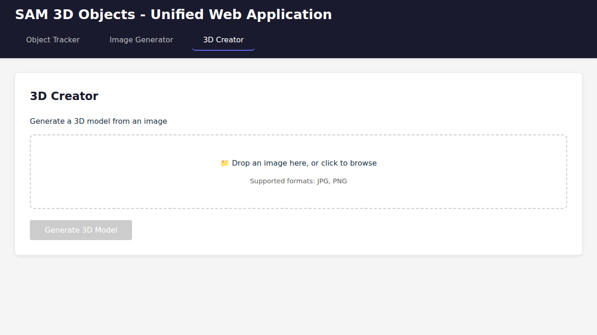

# Unified Web Application Setup Guide

This guide explains how to set up and run the unified SAM 3D Objects web application with React frontend and Python FastAPI backend.

## Overview

The unified web application consists of:
- **Backend**: Python FastAPI server that provides AI API endpoints and serves the React frontend
- **Frontend**: React + TypeScript + Vite single-page application

## Screenshots

### Object Tracker


### Image Generator


### 3D Creator


## Quick Start with Docker

The easiest way to run the application is using Docker:

```bash
# 1. Build the frontend
cd frontend
npm install
npm run build
cd ..

# 2. Build and run the Docker container
docker build -t sam3d-webapp -f backend/Dockerfile .
docker run -p 8000:8000 \
  -e HF_TOKEN="your_huggingface_token" \
  -e KIE_API_KEY="your_kie_api_key" \
  --gpus all \
  sam3d-webapp
```

The application will be available at `http://localhost:8000`.

## Development Setup

### Prerequisites

- Python 3.12
- Node.js 18+
- NVIDIA GPU with CUDA 12.6 (for backend)
- Hugging Face account with access to SAM 3D Objects model

### Backend Setup

1. **Install Python dependencies:**

```bash
# Install PyTorch with CUDA 12.6
pip install torch==2.7.0+cu126 torchvision==0.20.0+cu126 --index-url https://download.pytorch.org/whl/cu126

# Or use CUDA 12.1 if 12.6 is not available
pip install torch==2.5.1+cu121 torchvision==0.20.1+cu121 --index-url https://download.pytorch.org/whl/cu121

# Install backend requirements
pip install -r backend/requirements.txt

# Install SAM 3D Objects package
pip install -e .
```

2. **Clone and install SAM 3 (optional, for extended features):**

```bash
git clone https://github.com/facebookresearch/sam3.git /tmp/sam3
cd /tmp/sam3
pip install -e .
cd -
```

3. **Download model checkpoints:**

Follow the instructions in [doc/setup.md](doc/setup.md) to download the SAM 3D Objects checkpoints from Hugging Face.

4. **Set environment variables:**

```bash
export HF_TOKEN="your_huggingface_token"
export KIE_API_KEY="your_kie_api_key"
```

5. **Run the backend server:**

```bash
python backend/server.py
```

The server will start on `http://localhost:8000`.

### Frontend Setup

1. **Install dependencies:**

```bash
cd frontend
npm install
```

2. **For development with hot reload:**

```bash
npm run dev
```

This starts the Vite dev server on `http://localhost:5173` with API proxying to the backend.

3. **For production build:**

```bash
npm run build
```

The build output will be in `frontend/dist/` and will be automatically served by the backend.

## Project Structure

```
sam-3d-objects/
├── backend/
│   ├── server.py           # FastAPI server
│   ├── requirements.txt    # Backend dependencies
│   ├── Dockerfile          # Docker configuration
│   └── README.md          # Backend documentation
├── frontend/
│   ├── src/
│   │   ├── components/    # React components
│   │   ├── App.tsx        # Main app
│   │   └── main.tsx       # Entry point
│   ├── package.json
│   ├── vite.config.ts
│   └── README.md         # Frontend documentation
├── sam3d_objects/         # SAM 3D Objects package
├── notebook/              # Inference utilities
└── checkpoints/           # Model checkpoints
```

## API Endpoints

The backend provides the following API endpoints:

- `GET /` - Serves the React frontend
- `GET /api/health` - Health check endpoint
- `POST /api/process/image` - Process images with SAM 3D
- `POST /api/process/video` - Process videos with SAM 3D
- `POST /api/generate/image-kie` - Generate images with kie.ai
- `POST /api/generate/3d` - Generate 3D models from images

## Features

### 1. Object Tracker
- Upload images or videos
- Specify objects to track using text prompts
- Download processed results as PLY files

### 2. Image Generator
- Generate images using kie.ai's Nano Banana service
- One-click transition to 3D model generation

### 3. 3D Creator
- Convert images to 3D models
- Interactive 3D viewer using React Three Fiber
- Download models in PLY format

## Environment Variables

- `HF_TOKEN` - Hugging Face authentication token (required)
- `KIE_API_KEY` - kie.ai API key for image generation
- `PORT` - Server port (default: 8000)
- `HOST` - Server host (default: 0.0.0.0)

## Troubleshooting

### CUDA/GPU Issues

Make sure you have:
- NVIDIA drivers installed
- CUDA 12.6 (or 12.1) installed
- Correct PyTorch version with CUDA support

### Model Loading Issues

Ensure you have:
- Valid Hugging Face token
- Access to SAM 3D Objects model on Hugging Face
- Downloaded checkpoints in `checkpoints/hf/` directory

### Frontend Build Issues

If the frontend build fails:
```bash
cd frontend
rm -rf node_modules package-lock.json
npm install
npm run build
```

## License

See the [LICENSE](LICENSE) file for details.
